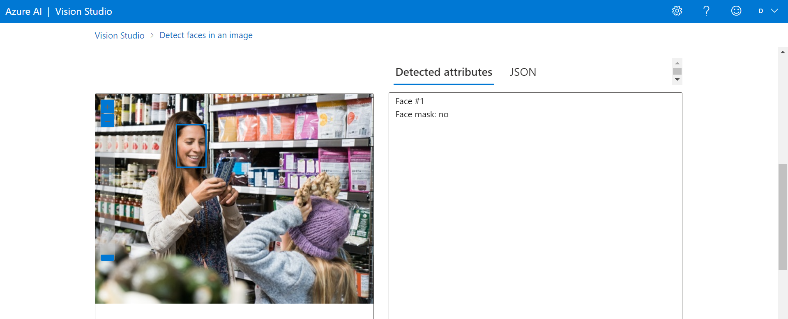
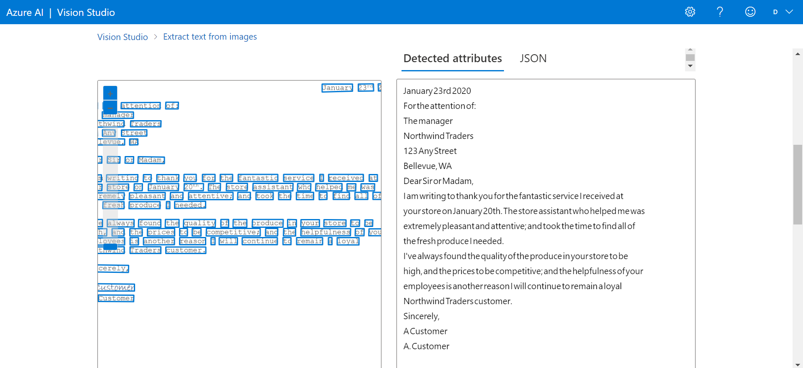
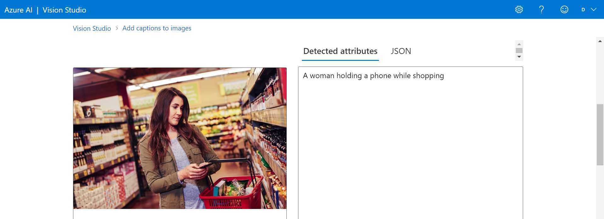

<h1>Reconhecimento Facial e transformação de imagens em Dados no Azure ML</h1>

<h2>1 - Detectar rostos no Vision Studio</h2>
Passo a passo:
 
https://microsoftlearning.github.io/mslearn-ai-fundamentals/Instructions/Labs/04-face.html
  
<b>Resultados:</b>
 
Entrada:
 

  
Saída:
 

 
<h2>2 - Ler texto no Vision Studio</h2>
Passo a passo:
 
https://microsoftlearning.github.io/mslearn-ai-fundamentals/Instructions/Labs/05-ocr.html
  
<b>Resultados:</b>
 
Entrada:
 

  
Saída:
 

 
<h2>3 - Analise imagens no Vision Studio</h2>
Passo a passo:
 
https://microsoftlearning.github.io/mslearn-ai-fundamentals/Instructions/Labs/03-image-analysis.html
  
<b>Resultados:</b>
 
Entrada:
 

  
Saída:
 

 
